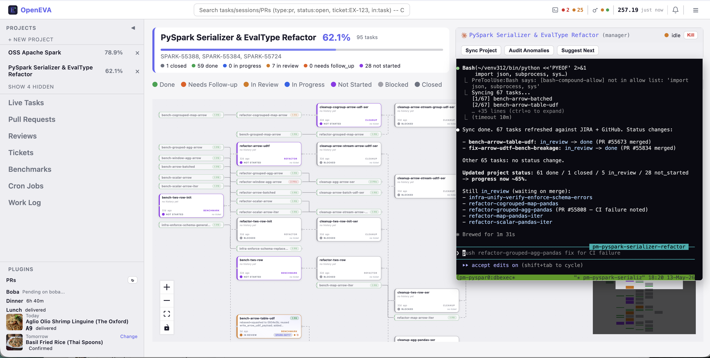
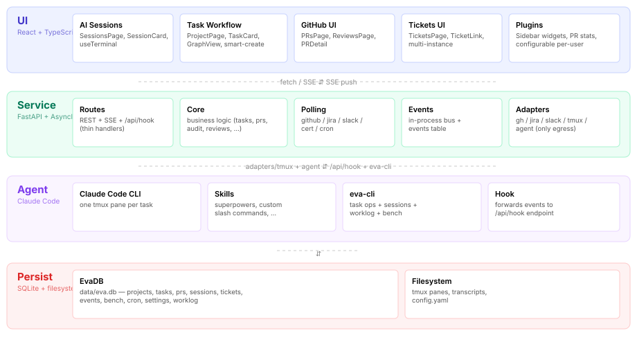

# OpenEVA

**Build your own workflow in the AI era.**

> Internal identifiers (`EvaDB`, `eva-cli`, the `EVA_*` env vars, the
> on-disk `data/eva.db`) keep the legacy `Eva` name -- only the public
> brand has changed, so existing scripts and configs keep working.

OpenEVA is a self-hosted productivity dashboard for engineers who juggle
dozens of in-flight PRs, JIRA-style tickets, recurring chores, and AI
coding sessions every day. It collapses the "spreadsheet of browser
tabs" problem into one local app with a SQLite store, a React UI, and
a plug-in surface for letting AI agents take over the busywork.



## Why

The default tools assume one process, one task, one person at a
keyboard. Real engineering work is the opposite -- many concurrent
PRs, half of them blocked, the rest waiting on flaky CI; reviews
owed back to teammates; tickets that don't update themselves; cleanup
work nobody schedules.

OpenEVA is what happens when you stop fighting that and build the
control plane yourself:

- **One queue per concern.** All Reviews, All PRs, All Sessions,
  Tickets -- each is a pre-filtered, deduplicated, live-synced view
  driven by background pollers.
- **Tasks own state.** Every task carries its own description,
  history, PRs, tickets, dependencies, and live agent session.
  Status transitions (`not_started -> in_progress -> in_review
  -> done`) auto-promote from PR merges so the board doesn't drift.
- **Sessions are first class.** Each task can spawn an AI session in
  a dedicated tmux pane, render its terminal inline in the browser,
  and ship structured events (state changes, tool calls, completions)
  back to the dashboard.
- **Cron jobs for routine work.** Recurring agent sessions
  (`/loop 30min /sync-my-prs`) tick on schedule, so the queue keeps
  flowing while you sleep.
- **Plugin-first.** Sidebar widgets, agents, channels, certs, and
  per-org extensions are all discovered at boot; nothing is
  hardcoded in core.

## Architecture



Four layers, one DB choke point:

- **UI** -- React 19 + Vite + TypeScript. Talks to Service via
  `fetch` + SSE.
- **Service** -- FastAPI + Uvicorn. Owns the HTTP / SSE surface,
  the background scheduler (APScheduler), and the event bus.
- **Agent layer** -- pluggable CLI agents (Claude Code by default;
  any process with a CLI + a hook script can plug in). Each
  session lives in a tmux pane the UI mirrors via xterm.js.
- **Storage** -- a single `EvaDB` SQLite database. Every write
  path goes through one class so concurrency, migrations, and
  audit logging stay manageable.

## Quickstart

```bash
git clone <eva-repo>
cd eva

# 1. Python deps (.venv at repo root is the convention used by
#    bin/restart-server.sh and run_tests.sh)
python -m venv .venv
.venv/bin/pip install -r requirements.txt

# 2. Frontend deps + build
cd frontend && npm install && npm run build && cd ..

# 3. Optional config: copy the template if you want JIRA/Slack/etc.
cp config.example.yaml config.yaml
# edit config.yaml to fill in your values

# 4. Run
bash bin/restart-server.sh
# Open http://localhost:8021
```

Default port `8021`; override via `EVA_PORT=9000 bash bin/restart-server.sh`.

Eva boots cleanly without any `config.yaml`. Every plugin is off by
default; the Settings UI is the source of truth at runtime for
repos, agents, themes, poller cadences, layout ratios, and JIRA
instances.

## CLI

`eva-cli` lives at the repo root. It auto-activates a venv from
`<repo>/.venv` or `$EVA_VENV` (in that order). Every
command supports `--json` for scripting:

```bash
./eva-cli list-projects --json
./eva-cli list-tasks my-project
./eva-cli audit                 # audit the local DB for stale rows
./eva-cli help                  # full subcommand index
```

Extensions can ship their own subcommands by dropping a
`<extension>/src/cli.py` -- they're auto-loaded.

## Repo Layout

```
core/                       # OSS base, always loaded
  src/
    server.py               # FastAPI entry (also a re-export shim for test compat)
    app_state.py            # Shared state: app, _db, config, event bus
    eva_db.py               # EvaDB class -- single SQLite DB at data/eva.db
    routes/                 # HTTP handlers (thin -- parse, call common.*, map errors)
    common/                 # Business logic. Testable without HTTP.
    services/               # Background jobs on a single AsyncIOScheduler
    adapters/               # The ONLY place that shells out / hits external APIs
    channels/               # Notification channels (slack, ...)
    agents/                 # Agent CLI integration
    plugins/                # OSS plugins (pr stats)
    utils.py / pr_sync.py / pty_manager.py
  test/                     # OSS test suite
<extension>/                # Sibling-of-core extensions (any folder with extension.conf)
  extension.conf            # Marker file -- id + name
  src/                      # Top-level modules + plugin folders
  test/                     # Extension tests
frontend/                   # React 19 + Vite + TypeScript
  src/{pages,components,hooks,utils}/
bin/restart-server.sh       # Server restart with zombie prevention
conftest.py                 # Root pytest fixtures, shared across core/ + extensions
eva-cli                     # Python CLI entry
eva-hook.sh                 # Forwards agent Stop/Notification events to /api/hook
run_tests.sh                # Runs pytest across core/test/ + each extension's test/
```

**Extensions.** Any sibling folder of `core/` with an `extension.conf`
is auto-loaded. Each extension can contribute pages, plugins, agents,
channels, certs, scheduler jobs, HTTP routes, and CLI subcommands --
no edits to core are required. Drop a folder, restart, done.

## Tests

```bash
# All trees (core + every extension)
bash run_tests.sh -q

# Just the core OSS suite
.venv/bin/python -m pytest core/test/ -q

# Coverage
.venv/bin/python -m pytest core/test/ --cov=core --cov-report=term-missing

# Frontend
cd frontend && npm test -- --run
```

**Contract:** tests never pollute external systems. Fixtures in
`conftest.py` redirect notification/event DBs to `tmp_path` and stub
every adapter that talks to tmux / GitHub / Slack.

## License

Apache License 2.0 -- see [LICENSE](LICENSE).
